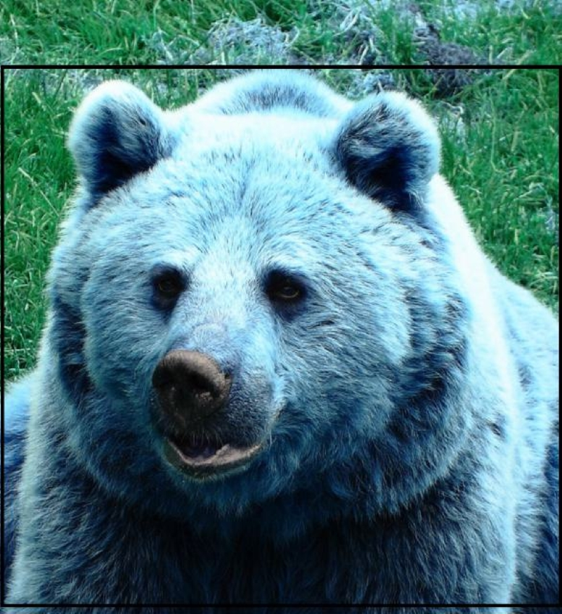
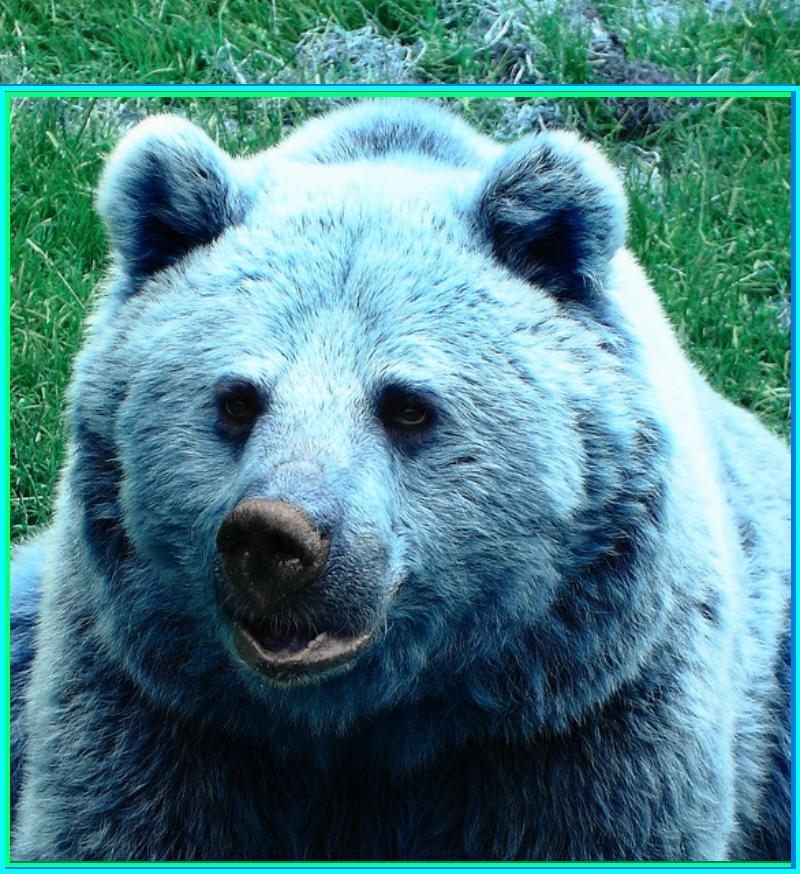
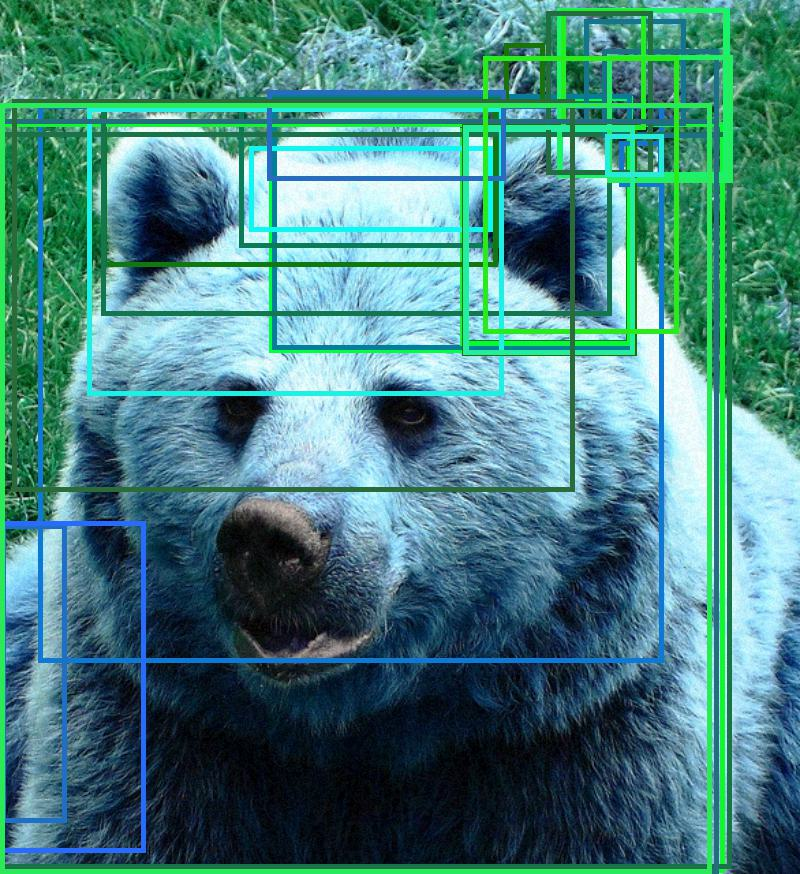

<div align="center">

# ARES 2.0: Robustness Evaluation for Object Detection

</div>

## Overview

Adversarial attacks impact not just image classification but also object detection tasks. In this project, we've introduced both global perturbation and patch-based adversarial attacks to assess the robustness of object detection models. Our framework seamlessly integrates with the widely-used [mmdet](https://github.com/open-mmlab/mmdetection) library, providing an accessible platform for researchers and developers.

## Features
- **Integrated with [mmdet](https://github.com/open-mmlab/mmdetection)** 
  - Compatible with plenty of models from mmdet. Assess their adversarial robustness using the provided config and weight files.


- **Global perturbation attack**  
   - Employ FGSM, BIM, and PGD techniques to test adversarial robustness.


- **Patch-based attack**  
    - Adversarial patches optimized gradient descent.
    - Shared patch for objects of the same class.
    - Each object receives a central patch.


- **Visualization**
    - Adversarial images can be saved easily for comparison, analysis, and data augmentation.


- **Distributed training and testing**  
    - Pytorch distributed data-parallel training and testing are supported for faster training and testing.
  
## Preparation
**Dataset**
- We evaluate the robustness of detection models on the coco2017 val dataset. Please download [coco2017](https://cocodataset.org) dataset first. The validation set `val2017` folder and annotations are needed by default. If you want to
  use your datasets, please convert them to coco-style with the corresponding metainfo.

**Detection Model**
- Train object detectors using [mmdet](https://github.com/open-mmlab/mmdetection) or directly download the detector weight files and config files provided by [mmdet](https://github.com/open-mmlab/mmdetection). You'd better use the complete config file generated by
  mmdet itself.

## Getting Started
- **Modify detector config files**
  - Modify all the `data_root` attributes in detector config files to your correct path, for example, `data_root=/path_to_your_datasets/coco2017/`. There are multiple `data_root` attributes in a mmdet-style config file. Please make sure that all `data_root` attributes are modified correctly.
  - Modify the `ann_file` attribute in the `test_evaluator` attribute to your correct path, for example, `ann_file= /path_to_your_dataset/coco2017/annotations/instances_val2017.json`.
  - If you use your datasets, the config files generated in the training process can usually be directly used. Specifically, please make sure that you have provided `metainfo` attribute for the attribute
  `dataset` in `train_dataloader` and `test_dataloader`as follows:
    ```python
    metainfo = {'classes': ['cls_1', 'cls_2', '...', 'cls_n']}
    train_dataloader = dict(batch_size=4, num_workers=4,
                            dataset=dict(data_root='/path_to_your_datasets/coco2017/',
                                         metainfo=metainfo,
                                         ann_file='annotations/instances_val2017.json',
                                         data_prefix=dict(img='images')
                                         ))
    test_dataloader = dict(batch_size=4, num_workers=4,
                           dataset=dict(data_root='/path_to_your_datasets/coco2017/',
                                        metainfo=metainfo,
                                        ann_file='annotations/instances_val2017.json',
                                        data_prefix=dict(img='images')
                                        ))
     ```


- **Global perturbation attack**
  * Modify the `detector` attribute in the [configs/global_demo.py](configs/global_demo.py) file according to your detector config file and weight file paths.
  * Run the following command to start:
    ```bash
    CUDA_VISIBLE_DEVICES=0 python run.py --cfg configs/global_demo.py
    ```
    Besides, you can also overwrite the `detector` attribute in the console and start by the following command:
    ```bash
    CUDA_VISIBLE_DEVICES=0 python run.py --cfg configs/demo.py --cfg-options detector.cfg_file=/path_to_your_detector_cfg_file detector.weight_file=/path_to_your_detector_weight_file
    ```
  * For more attack configurations, please refer to [configs/global/base.py](configs/global/base.py). Your can overwrite them
    in the `global_demo.py` file as you want . Up to now, FGSM, BIM, MIM, TIM, DI_FGSM, SI_NI_FGSM, VMI_FGSM and PGD attack methods are supported for the global perturbation attack.


- **Patch-based attack** 
    
  * Modify the `detector` attribute in the [configs/patch_demo.py](configs/patch_demo.py) file according to your detector config file and weight file paths.
  * Run the following command to start:
    ```bash
    CUDA_VISIBLE_DEVICES=0 python run.py --cfg configs/patch_demo.py
    ```
  * For more attack configurations, please refer to [configs/patch/base.py](configs/patch/base.py). You can overwrite them in the `global_demo.py` file as you want. 


- **Distributed training and testing**

  Pytorch distributed dataparallel (DDP) is supported. To start DDP training or testing,  please refer to the [run_dist.sh](run_dist.sh) for details.

- **Evaluating non-mmdet detectors**

  If you want to evalute non-mmdet detectors, you may try following steps:
  * Convert dataset to coco-style.
  * Generate a mmdet-style config file containing a `test_dataloader`, `train_dataloader` (if needed),
    and a `test_evaluator`. 
  * Modify your detection model code. Specifically, you are required to add a data_preprocessor, a loss function and a predict function. See `ares.attack.detection.custom.detector.CustomDetector` for details.
  * Replace `detector = MODELS.build(detector_cfg.model)` in the `run.py` file with your detector initialization code.

## Results

- **Evaluation of some object detection models**

  Attack settings: global perturbation attack using PGD with eps=2 under L $\infty$ norm
  
    |    Detector     |                                                                        Config                                                                         |                                                                                                           Weight                                                                                                            |    IoU     | Area | MaxDets | AP (clean) | AP (attacked) |
    |:---------------:|:-----------------------------------------------------------------------------------------------------------------------------------------------------:|:---------------------------------------------------------------------------------------------------------------------------------------------------------------------------------------------------------------------------:|:----------:|:----:|:-------:|:----------:|:-------------:|
    |  Faster R-CNN   |                [config](https://github.com/open-mmlab/mmdetection/blob/main/configs/faster_rcnn/faster-rcnn_x101-64x4d_fpn_1x_coco.py)                |                              [weight](https://download.openmmlab.com/mmdetection/v2.0/faster_rcnn/faster_rcnn_x101_64x4d_fpn_1x_coco/faster_rcnn_x101_64x4d_fpn_1x_coco_20200204-833ee192.pth)                              | 0.50:0.95  | all  |   100   |   0.422    |     0.041     | 
    |     YOLO v3     |            [config](https://github.com/open-mmlab/mmdetection/blob/main/configs/yolo/yolov3_d53_8xb8-ms-608-273e_coco.py)                             |                                         [weight](https://download.openmmlab.com/mmdetection/v2.0/yolo/yolov3_d53_mstrain-608_273e_coco/yolov3_d53_mstrain-608_273e_coco_20210518_115020-a2c3acb8.pth)                       | 0.50:0.95  | all  |   100   |   0.337    |     0.062     | 
    |       SSD       |                               [config](https://github.com/open-mmlab/mmdetection/blob/main/configs/ssd/ssd512_coco.py)                                |                                                     [weight](https://download.openmmlab.com/mmdetection/v2.0/ssd/ssd512_coco/ssd512_coco_20210803_022849-0a47a1ca.pth)                                                      | 0.50:0.95  | all  |   100   |   0.295    |     0.039     | 
    |    RetinaNet    |                     [config](https://github.com/open-mmlab/mmdetection/blob/main/configs/retinanet/retinanet_r50_fpn_1x_coco.py)                      |                                        [weight](https://download.openmmlab.com/mmdetection/v2.0/retinanet/retinanet_r50_fpn_1x_coco/retinanet_r50_fpn_1x_coco_20200130-c2398f9e.pth)                                        | 0.50:0.95  | all  |   100   |   0.365    |     0.027     | 
    |    CenterNet    |             [config](https://github.com/open-mmlab/mmdetection/blob/main/configs/centernet/centernet-update_r50-caffe_fpn_ms-1x_coco.py)              |                    [weight](https://download.openmmlab.com/mmdetection/v3.0/centernet/centernet-update_r50-caffe_fpn_ms-1x_coco/centernet-update_r50-caffe_fpn_ms-1x_coco_20230512_203845-8306baf2.pth)                     | 0.50:0.95  | all  |   100   |   0.401    |     0.070     | 
    |      FCOS       | [config](https://github.com/open-mmlab/mmdetection/blob/main/configs/fcos/fcos_r50-dcn-caffe_fpn_gn-head-center-normbbox-centeronreg-giou_1x_coco.py) | [weight](https://download.openmmlab.com/mmdetection/v2.0/fcos/fcos_center-normbbox-centeronreg-giou_r50_caffe_fpn_gn-head_dcn_1x_coco/fcos_center-normbbox-centeronreg-giou_r50_caffe_fpn_gn-head_dcn_1x_coco-ae4d8b3d.pth) | 0.50:0.95  | all  |   100   |   0.422    |     0.045     | 
    |      DETR       |                         [config](https://github.com/open-mmlab/mmdetection/blob/main/configs/detr/detr_r50_8xb2-150e_coco.py)                         |                                         [weight](https://download.openmmlab.com/mmdetection/v3.0/detr/detr_r50_8xb2-150e_coco/detr_r50_8xb2-150e_coco_20221023_153551-436d03e8.pth)                                         | 0.50:0.95  | all  |   100   |   0.397    |     0.074     | 
    | Deformable DETR |      [config](https://github.com/open-mmlab/mmdetection/blob/main/configs/deformable_detr/deformable-detr-refine-twostage_r50_16xb2-50e_coco.py)      |        [weight](https://download.openmmlab.com/mmdetection/v3.0/deformable_detr/deformable-detr-refine-twostage_r50_16xb2-50e_coco/deformable-detr-refine-twostage_r50_16xb2-50e_coco_20221021_184714-acc8a5ff.pth)         | 0.50:0.95  | all  |   100   |   0.469    |     0.067     | 
    |      DINO       |                    [config](https://github.com/open-mmlab/mmdetection/blob/main/configs/dino/dino-5scale_swin-l_8xb2-12e_coco.py)                     |                                [weight](https://download.openmmlab.com/mmdetection/v3.0/dino/dino-5scale_swin-l_8xb2-12e_coco/dino-5scale_swin-l_8xb2-12e_coco_20230228_072924-a654145f.pth)                                | 0.50:0.95  | all  |   100   |   0.570    |     0.086     | 
    |      YOLOX      |                         [config](https://github.com/open-mmlab/mmdetection/blob/main/configs/yolox/yolox_l_8xb8-300e_coco.py)                         |                                          [weight](https://download.openmmlab.com/mmdetection/v2.0/yolox/yolox_l_8x8_300e_coco/yolox_l_8x8_300e_coco_20211126_140236-d3bd2b23.pth)                                           | 0.50:0.95  | all  |   100   |   0.491    |     0.098     |
   
- **Visualizations**  
    Detector: FCOS  
    Adversarial image: PGD attack with eps=5/255 under L $\infty$ setting   
    <table>
    <tr>
    <td><center><center><p>GT bboxes<br>(clean image)</p></center></center></td>
    <td><center><center><p>predicted bboxes<br>(clean image)</p></center></center></td>
    <td><center><center><p>predicted bboxes<br>(adversarial image)</p></center></center></td>
    </tr>
    </table>

## Acknowledgement

Many thanks to these excellent open-source projects:

- [mmdet](https://github.com/open-mmlab/mmdetection)
- [AdvPatch](https://gitlab.com/EAVISE/adversarial-yolo) - [Paper
  ](http://openaccess.thecvf.com/content_CVPRW_2019/papers/CV-COPS/Thys_Fooling_Automated_Surveillance_Cameras_Adversarial_Patches_to_Attack_Person_Detection_CVPRW_2019_paper.pdf)
