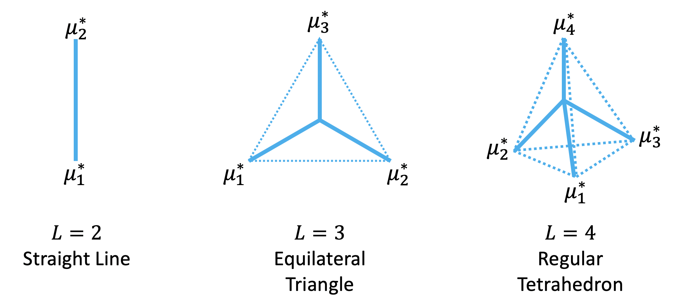

# Max-Mahalanobis Training
Max-Mahalanobis Training (MMT) is a novel training method, which can learn more robust models without hurting clean accuracy and with little extra computational cost.
Technical details are specified in:

[Max-Mahalanobis Linear Discriminant Analysis Networks](http://proceedings.mlr.press/v80/pang18a/pang18a.pdf) (ICML 2018)

Tianyu Pang, Chao Du and Jun Zhu

[Rethinking Softmax Cross-Entropy Loss for Adversarial Robustness](https://arxiv.org/pdf/1905.10626.pdf) (ICLR 2020)

Tianyu Pang, Kun Xu, Yinpeng Dong, Chao Du, Ning Chen and Jun Zhu

## Environment settings and libraries we used in our experiments

This project is tested under the following environment settings:
- OS: Ubuntu 16.04.3
- GPU: Geforce 1080 Ti or Tesla P100
- Cuda: 9.0, Cudnn: v7.03
- Python: 2.7.12
- cleverhans: 2.1.0
- Keras: 2.2.4
- tensorflow-gpu: 1.9.0

We also thank the authors of [keras-resnet](https://github.com/raghakot/keras-resnet) for providing their code. Our codes are widely adapted from their repositories. For convenience, we provide the *requirement.txt* file to install the virtualenv that is sufficient run the codes.

In the following, we first provide the codes for training. After that, the evaluation codes, such as attacking, are provided.

## Demo of MM centers (mean_logits in the code)


This plot shows the MM centers under different number of classes `L`. 

## Training codes

### Standard training with the SCE loss

Let `dataset` be `mnist`, `cifar10` or `cifar100`, the command for training models with the SCE loss is
```shell
python train.py --batch_size=50 --dataset=[dataset] --optimizer='mom' --lr=0.01 --version=2 --use_MMLDA=False --use_BN=True --use_dense=True --use_leaky=False
```
Here the initial learning rate is `0.01`, the optimizer is `mom` and we use the `Resnet-v2` architecture proposed by [He et al. (2016)](https://arxiv.org/abs/1603.05027). The training epoch on MNIST is set as 40, on CIFAR-10 and CIFAR-100 is set as 200.

### Standard training with the MMC loss
Similarly, let `dataset` be `mnist`, `cifar10` or `cifar100`, the command for training models with the MMC loss is
```shell
python train.py --batch_size=50 --mean_var=10 --dataset=[dataset] -optimizer='mom' --lr=0.01 --version=2 --use_MMLDA=True --use_ball=True --use_BN=True --use_random=False --use_dense=True --use_leaky=False
```
Here the basic training setting, e.g., learning rate and optimizer are the same as them for the SCE loss. The `meanvar` parameter is the $C_{MM}$ of the MMC loss in the paper. When the bool flag `use_ball` is False, the command run the training with the MMLDA loss.

### Adversarial training with the SCE loss
For the adversarial training, we apply the most widely studied PGD-based method proposed by [Madry et al. (2017)](https://arxiv.org/abs/1706.06083).
```shell
python advtrain.py --batch_size=50 --dataset=[dataset] --optimizer='mom' --lr=0.01 --version=2 --adv_ratio=1.0 --use_MMLDA=False --use_ball=False --use_target=False --attack_method='MadryEtAl' --use_BN=True --use_random=False
```
Here the `adv_ratio` is set as 1, which means we only use adversarial examples in the training phase as suggested in previous work. The bool flag `use_target` indicates whether uses targeted attack or untargeted attack when crafting adversarial examples for training.

### Adversarial training with the MMC loss
The adversarial training command is similar for the MMC loss
```shell
python advtrain.py --batch_size=50 --mean_var=10 --dataset=[dataset] --optimizer='mom' --lr=0.01 --version=2 --adv_ratio=1.0 --use_MMLDA=True --use_ball=True --use_target=True --attack_method='MadryEtAl' --use_BN=True --use_random=False
```

## Evaluation codes

The pretrained models are provided below for Resnet110 (n=18): 

[MMC (CIFAR-10)](http://ml.cs.tsinghua.edu.cn/~tianyu/MMC/pretrained_models/MMC_mom_cifar10/model.200.h5)

[MMC (CIFAR-100)](http://ml.cs.tsinghua.edu.cn/~tianyu/MMC/pretrained_models/MMC_mom_cifar100/model.200.h5)

[MMC + adv-training (CIFAR-10)](http://ml.cs.tsinghua.edu.cn/~tianyu/MMC/pretrained_models/MMC_mom_advtrain_cifar10/model.180.h5)

[MMC + adv-training (CIFAR-100)](http://ml.cs.tsinghua.edu.cn/~tianyu/MMC/pretrained_models/MMC_mom_advtrain_cifar100/model.180.h5).

### White-box L-infinity attack (PGD)
In this setting, the attacking methods are usually iterative-based. For examples, the command of applying targeted PGD-10 to evade the models trained by the MMC loss is
```shell
python advtest_iterative.py --batch_size=50 --attack_method='MadryEtAl' --attack_method_for_advtrain=None --dataset=[dataset] --target=True --num_iter=10 --use_ball=True --use_MMLDA=True --use_advtrain=False --epoch=[epoch] --use_BN=True --normalize_output_for_ball=False --use_random=False --use_target=False
```
Here `attack_method` could be 'MadryEtAl' (PGD), 'FastGradientMethod' (FGSM), 'MomentumIterativeMethod' (MIM) and 'BasicIterativeMethod' (BIM). The `target` indicates whether use targeted or untargeted attack; `num_iter` is the iteration steps of the performed attacks; `epoch` is the epoch of the checkpoint to load; `normalize_output_for_ball` is a bool flag to decide whether apply a softmax function to return predictions in the inference phase.

**Note that our evaluation is based on cleverhans: 2.1.0. To perform adaptive attack, please manually modify the function** ```model_loss``` **of the file** ```utils_tf.py```**by substituting the softmax cross-entropy loss with other adaptive objectives, e.g.,** ```out=-tf.reduce_sum(logits * y, axis=-1)```.

When attacking the adversarially trained models, we should set the `use_advtrain` as True, and the `attack_method_for_advtrain` to be 'MadryEtAl' since we use the PGD-based adversarial training methods. The `use_target` is set the same as in the training codes. For examples, the command of applying untargeted PGD to evade the models adversarially trained by the MMC loss is
```shell
python advtest_iterative.py --mean_var=10 --batch_size=50 --attack_method='MadryEtAl' --attack_method_for_advtrain='MadryEtAl' --dataset=[dataset] --target=False --num_iter=10 --use_ball=True --use_MMLDA=True --use_advtrain=True --epoch=[epoch] --use_BN=True --normalize_output_for_ball=False --use_random=False --adv_ratio=1.0 --use_target=False
```
Note that here we set `normalize_output_for_ball` be False to perform an adaptive attacks.

### White-box L-2 attack (C&W)
In this setting, the attacking methods are usually optimization-based. In the C&W method, there is a binary search mechanism for the constant parameter to find sucessful adversarial examples with minimal distortion. The command below gives an example of applying targeted C&W attack on the models trained by the MMC loss. 
```shell
python advtest_others.py --mean_var=10 --batch_size=50 --attack_method='CarliniWagnerL2' --attack_method_for_advtrain=None --dataset=[dataset] --target=True --use_ball=True --use_MMLDA=True --use_advtrain=False --adv_ratio=1.0 --use_target=False --epoch=[epoch] --use_BN=True --normalize_output_for_ball=False --use_random=False --use_dense=True --use_leaky=False --CW_confidence=0.
```
The specific parameter settings of the C&W attack can be found in the code. The `attack_method` could also be 'ElasticNetMethod' to perform EAD attack.

### Black-box transfer-based attack (MIM & PGD)
For the black-box transfer-based setting, we apply the MIM and PGD attacks. An example command using the untargeted PGD-10 attack is shown below
```shell
python advtest_iterative_blackbox.py --batch_size=50 --optimizer='Adam' --attack_method='MadryEtAl' --dataset=[dataset] --target=False --num_iter=10 --use_random=False --use_dense=True --use_leaky=False --epoch=[epoch] --use_BN=True --model_1='AT-MMC-100' --model_2='SCE'
```
Here `model_1` is the substitute model used to craft adversarial examples, `model_2` is the original model used to classify these adversarial examples. These two parameters could be `SCE`, `MMC-10`, `MMC-100`, `AT-SCE`, `AT-MMC-10`, `AT-MMC-100`. The `epoch` here is the training epoch of checkpoint for both the model_1 and model_2.

### Black-box gradient-free attack (SPSA)
For the black-box gradient-free setting, we apply the SPSA attack. This attacks is based on numerical approximations of the model gradients, and can evade the defenses that based on gradient masking. An example command is given below for untargeted SPSA-10 attack on the models trained by the MMC loss.
```shell
python advtest_others.py --mean_var=10 --batch_size=50 --attack_method='SPSA' --attack_method_for_advtrain=None --dataset=[dataset] --target=False --use_ball=True --use_MMLDA=True --use_advtrain=False --adv_ratio=1.0 --use_target=False --epoch=[epoch] --use_BN=True -normalize_output_for_ball=False --use_random=False --use_dense=True --use_leaky=False --SPSA_epsilon=8
```
More details of the parameter settings can be found in the code.

### General-purpose attack
To further test the robustness of our method, we investigate the general-purpose attacks. We add the Gaussian random noise and random rotation transformation on the input images to perform the attacks. An example command is
```shell
python advtest_simple_transform.py --mean_var=10 --batch_size=50  --attack_method='Rotation' --attack_method_for_advtrain='MadryEtAl' --dataset=[dataset] --use_ball=True --use_MMLDA=True --use_advtrain=True --epoch=[epoch] --adv_ratio=1.0 --use_target=False --normalize_output_for_ball=False
```
The `attack_method` could be 'Rotation' for rotation transformation or 'Gaussian' for Gaussian noise. Detailed parameter settings are provided in the code.
