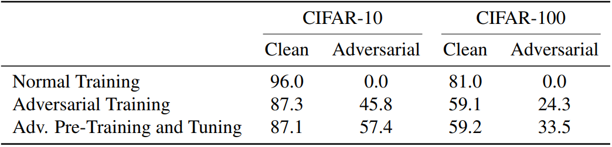

# Using Pre-Training Can Improve Model Robustness and Uncertainty

This repository contains the essential code for the paper [_Using Pre-Training Can Improve Model Robustness and Uncertainty_](https://arxiv.org/abs/1901.09960), ICML 2019.

Requires Python 3+ and PyTorch 0.4.1+.

## Abstract

[Kaiming He et al. (2018)](https://arxiv.org/abs/1811.08883) have called into question the utility of pre-training by showing that training from scratch can often yield similar performance, should the model train long enough. We show that although pre-training may not improve performance on traditional classification metrics, it does provide large benefits to model robustness and uncertainty. With pre-training, we show approximately a 30% relative improvement in label noise robustness and a _10% absolute improvement in adversarial robustness_ on CIFAR-10 and CIFAR-100. Pre-training also improves model calibration. In some cases, using pre-training without task-specific methods surpasses the state-of-the-art, highlighting the importance of using pre-training when evaluating future methods on robustness and uncertainty tasks.

## Citation

If you find this useful in your research, please consider citing:

    @article{hendrycks2019pretraining,
      title={Using Pre-Training Can Improve Model Robustness and Uncertainty},
      author={Hendrycks, Dan and Lee, Kimin and Mazeika, Mantas},
      journal={Proceedings of the International Conference on Machine Learning},
      year={2019}
    }

